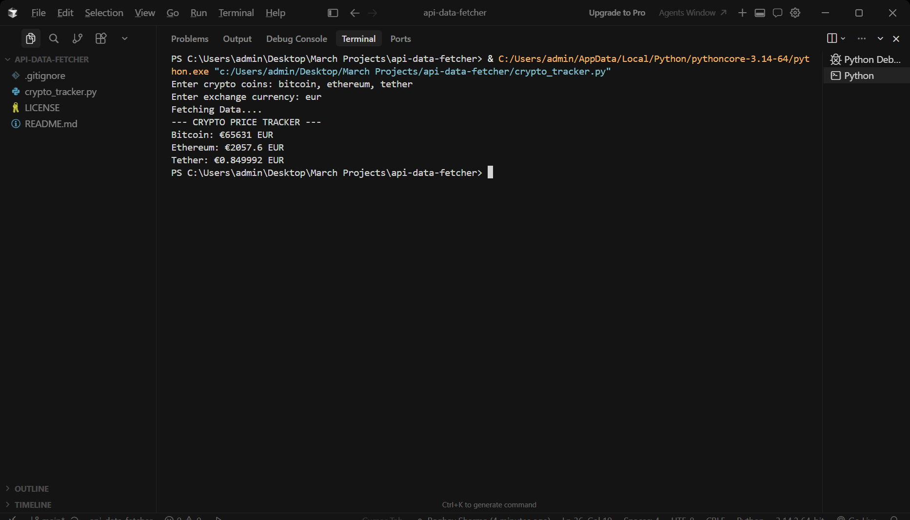

# Crypto CLI Tracker

A simple command-line Python tool that fetches real-time cryptocurrency prices using the CoinGecko API.

## 🚀 Features

* Fetch live crypto prices (Bitcoin, Ethereum, etc.)
* Supports multiple currencies (INR, USD, EUR)
* Dynamic user input for coins and currency
* Clean CLI-based output
* Robust input handling

## 🛠️ Tech Stack

* Python
* Requests (API handling)

## 📦 How to Run

```bash
pip install requests
python main.py
```

## 📌 Example

```
Enter crypto coins: bitcoin, ethereum
Enter exchange currency: inr

Fetching Data....
--- CRYPTO PRICE TRACKER ---
Bitcoin: ₹7174858 INR
Ethereum: ₹225248 INR
```

## 📈 Learning Outcome

* API integration
* Data processing
* Input sanitization
* Clean code structuring using OOP

## 📸 Sample Output


